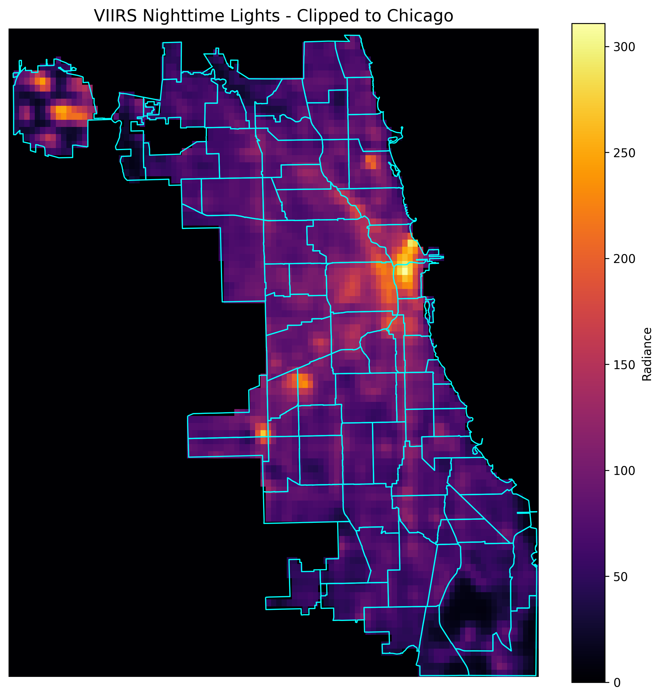
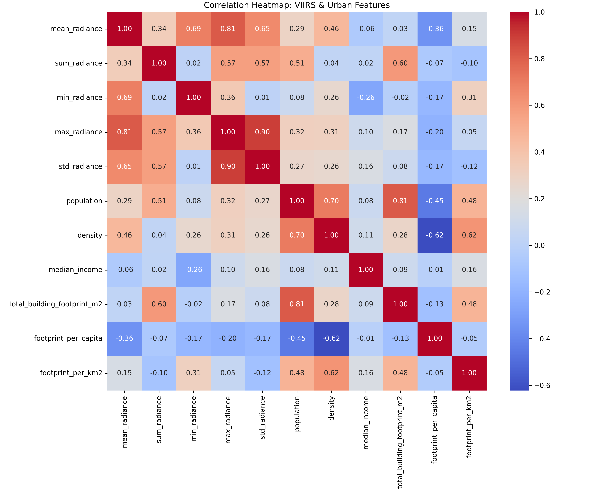

# how-lit-is-chicago
a statistical dive into Chicago’s vibe after dark...

## Why Light Pollution?

Honestly, this whole project started because one evening, I saw **fireflies** — for the first time in years.
They’re those tiny glowing bugs I always knew existed, but hadn’t really thought about in forever. That night, they caught my eye, and it hit me how easily we forget what the night used to look like — before all the artificial light. So I decided to dig into urban light patterns in Chicago to see if I could find factors influencing nightlight and try and predict an area's Nighttime light.

---

## The Script Rundown

- **`load_plot_chicago.py`**  
  Loads and plots Chicago’s community area shapefile so you can see the turf we’re working on. Maps > spreadsheets, always.

- **`clip_viirs_to_chicago.py`**  
  Clips the global VIIRS nighttime lights raster to just Chicago’s city limits — no need to waste pixels on Wisconsin.

- **`extract_viirs_stats_by_neighborhood.py`**  
  Calculates radiance stats (mean, sum, min, max, std) of nighttime light per community area by masking the raster with polygons.

- **`merge_viirs_acs.py`**  
  Merge the VIIRS light stats with American Community Survey (ACS) demographic data.

- **`merge_light_complaints.py`**  
  Adds counts of 311 streetlight outage complaints per community area from city data. More complaints = maybe less light? We’ll see.

- **`building_footprint.py`**  
  Computes total building footprint area per community area using Chicago building footprints shapefile and merges it with the existing data.

- **`analyze_data.py` & `analyze_data_again.py`**  
  Runs exploratory data analysis (EDA), calculates median income, population density, and new features like footprint per capita. Then plots correlation heatmaps between all these urban features and nighttime light intensity.

---

## Key Results



Here’s a sample heatmap from the correlation matrix that shows how different features like population, building footprint, and income relate to nighttime light intensity:



*(And yep, I looked at a bunch of numbers — turns out light intensity is influenced by many urban factors, but no single one dominates.)*

---

## How to Run

1. Download all raw data files (VIIRS raster, Chicago shapefiles, ACS data, 311 complaints, building footprints) and place them in the `data/raw/`.
2. Run scripts in this order:  
   ```bash
   python load_plot_chicago.py
   python clip_viirs_to_chicago.py
   python extract_viirs_stats_by_neighborhood.py
   python merge_viirs_acs.py
   python merge_light_complaints.py
   python building_footprint.py
   python analyze_data_again.py

---

## Status

So I threw a bunch of features at the wall — population, income, 311 complaints, building footprints — hoping something sticks.<br>
Spoiler: nothing really did, none of them had a strong correlation with VIIRS nighttime light levels.<br>
So, modeling it didn't really make sense **yet** — the data just wasn't giving what it was supposed to give.<br>
**P.S.** might model later..
